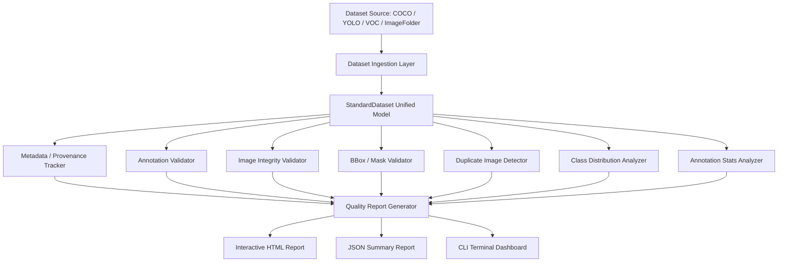

# System Architecture

## Modular Layer Breakdown

1. **Ingestion Layer (`src/ingestion/`)**: Standardizes diverse dataset formats into unified `StandardDataset`, `DatasetItem`, `ImageInfo`, and `AnnotationInfo` objects.
2. **Validation Layer (`src/validation/`)**: Modular rules executing deterministic quality checks on metadata, images, annotations, and bounding boxes.
3. **Quality Layer (`src/quality/`)**: Perceptual hashing and content-based duplicate search.
4. **Metrics Layer (`src/metrics/`)**: High-level statistical profiling (class imbalance, scale bins).
5. **Reporting Layer (`src/reporting/`)**: Interactive HTML, JSON, and CLI dashboard generation.
